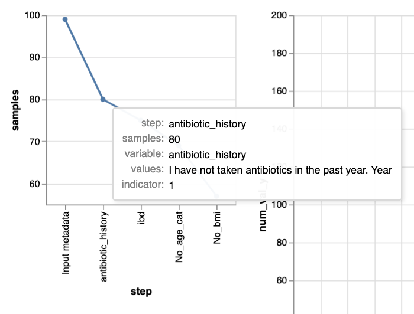
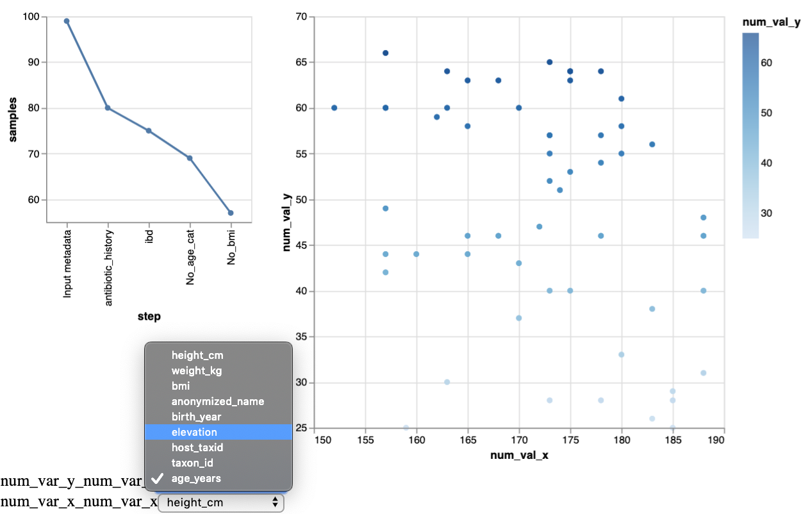
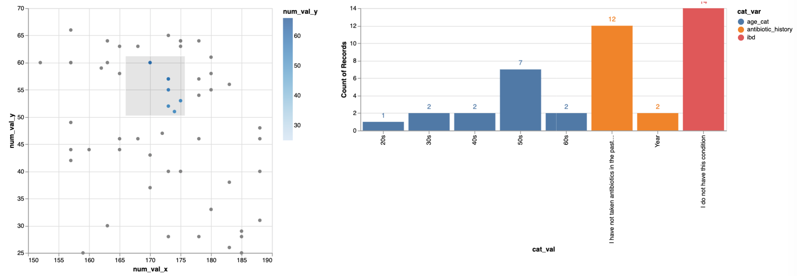

# Xclusion_criteria

Generate interactive, user-defined visualisations to help defining 
inclusion/exclusion criteria on a metadata table.

## Description

Defining inclusion/exclusion criteria can be trouble some and the 
subsetting of metadata file for non-expert users can be a challenge. 
This tools allows to apply a series of inclusion/exclusion criteria 
in a given order and allows retrieving both the included and excluded 
sample selection along with user-defined visualization hat allows 
scrutinizing categories that might be of interest for a future study 
(e.g. to make sure that particular study groups are balanced.)

## Installation

#### Dependencies


`numpy >= 1.18.1`, `pandas >= 1.0.1`, `cython >= 0.29.15`

#### Install

```
git clone https://github.com/FranckLejzerowicz/Xclusion_criteria.git
cd Xclusion_criteria
pip install -e .
```

*_Note that python and pip should be python3_

## Input

- **[REQUIRED]** _option_ `-m`: Path to the metadata file (can read a tab-, comma- 
or semi-colon-separated table. The names will be  lower-cased and 
the sample IDs column will be renamed `sample_name`).

- **[REQUIRED]** _option_ `-c`: Path the a yaml file containing the criteria.
    ```
    init:
      antibiotic_history,1:
        - 'I have not taken antibiotics in the past year.'
        - 'Year'
      age_cat,0:
        - 'NULLS'
        - '70+'
        - 'child'
        - 'teen'
        - 'baby'
      bmi,2:
        - '18'
        - 'None'
    add:
      alcohol_consumption,1:
        - 'No'
    filter:
      alcohol_types_red_wine,1:
        - 'Yes'
    no_nan:
      - bmi
    ```
    There are four possible main filtering steps:
    - `init`
    - `add`
    - `filter`
    - `no_nan`
    
    For the three first steps (`init`, `add` and `filter`), the format is exactly 
    the  same and consists in providing 3 pieces of information for each variable
    based on which to filter (_multi-variable filtering will soon be possible!_):
    1. the variable name (as in the metadata but lower case), e.g. `antibiotic_history`
    2. a numeric indicator telling whether the filtering based on the variable's content 
    should be a  "remove it", "keep it" or "must be in range", e.g. the `0` in 
    `antibiotic_history,0:`:
        * "remove it": `0`
        * "keep it": `1`
        * "must be in range": `2`
    3. the list of factors that are considered for the filtering based on the
    variable (must be exactly as in the table), e.g. for `antibiotic_history,0:`
        ```
        - "I have not taken antibiotics in the past year."
        - "Year"
        ```
    For the  numeric indicator `2`, the range **must** be composed of two values:
    a minimum and a maximum (in this order), e.g.
    ```
    age,2:
      - 10
      - 70
    ```
    It is possible to not set a minimum or a maximum bound, by writing "None" instead, e.g.   
    ```
    age,2:
      - 10
      - None
    ```
    (but there must be 2 items...)
    
    The fourth key `no_nan` is special: if present, it lists the variables that will be 
    filtered so that no sample will be left that has a _missing value_ for these variables. 
    These _missing values_ are formal NumPy's "nan" (`np.nan`), as well as any of these terms:
    - unknown
    - unspecified
    - not provided
    - not applicable
    - missing
    - nan
    
    (this default _missing values_ vocabulary can be edited, 
    in file `./Xclusion_criteria/resources/nulls.txt`)

- _option_ `-p`: Path to a yaml file containing the plotting's categorical variables, e.g.:
    ```
    categories:
      - bmi_cat
      - age_years
      - types_of_plants
    ```
    There will be barplot bars for each factor of each 
    of these categorical variables (see image below).

## Outputs

- _option_ `-in`: Metadata table reduced to the samples satisfying all the inclusion criteria (the **selecion**).
- _option_ `-ex`: Metadata table reduced to the samples not satisfying a least one inclusion criteria.
- _option_ `-o`: Interactive visualization composed of three panels (see below).

## Example

This command:
```
 Xclusion_criteria \
    -m Xclusion_criteria/tests/metadata/md.tsv \
    -c Xclusion_criteria/examples/criteria.yml \
    -p Xclusion_criteria/examples/plot.yml \
    -in Xclusion_criteria/tests/output/md_out.tsv \
    -o Xclusion_criteria/tests/output/md_viz.html
```

#### Interactive visualization

the `-o` html output has 3 panels:
1. Samples selection progression at each inclusion/exclusion criteria step is reported.

_(interaction: hovering on the steps/dots with the mouse shows
the variable and variable's factors used for selection)_

2. Samples on a scatter plot which x and y axes could be changed using a dropdown menu.


3. Barplots showing the number of samples for each of the different factors of the user-defined catergories. By 
 default, these are for all the samples of the final selection. This selection can be further refined by selecting
 samples using click-and-brush on the scatter.


### Optional arguments

``` 
Usage: Xclusion_criteria [OPTIONS]

Options:
  -m, --m-metadata-file TEXT  Metadata file on which to apply
                              included/exclusion criteria.  [required]

  -c, --i-criteria TEXT       Must be a yaml file (see README or
                              'examples/criteria.yml').  [required]

  -p, --i-plot-groups TEXT    Must be a yaml file (see README or
                              'examples/criteria.yml').

  -in, --o-included TEXT      Output metadata for the included samples only.
                              [required]

  -ex, --o-excluded TEXT      Output metadata for the excluded samples only.
  -o, --o-visualization TEXT  Output metadata explorer for the included
                              samples only.  [required]

  --random / --no-random      Reduce visualization to 100 random samples.
                              [default: True]

  --version                   Show the version and exit.
  --help                      Show this message and exit.
```


### Bug Reports

contact `flejzerowicz@health.ucsd.edu`